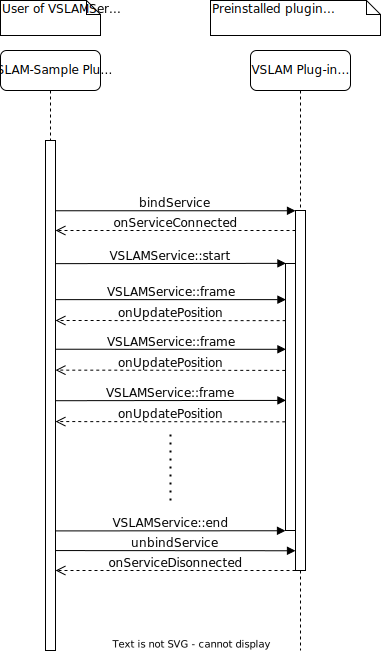

# VSLAM-plugin-sample
- [VSLAM-plugin-sample](#vslam-plugin-sample)
  - [Overview](#overview)
  - [Environment](#environment)
  - [Structure](#structure)
    - [Interface description](#interface-description)
      - [**IVSLAMService.aidl**](#ivslamserviceaidl)
      - [**IVSLAMServiceListener.aidl**](#ivslamservicelisteneraidl)
  - [How to use VSLAM service](#how-to-use-vslam-service)
    - [1. Setup AndroidManifest.xml](#1-setup-androidmanifestxml)
    - [2. Add VSLAM service to your application](#2-add-vslam-service-to-your-application)
    - [3. Prepare the shared memory](#3-prepare-the-shared-memory)
    - [4. Bind VSLAM service](#4-bind-vslam-service)
    - [5. Start VSLAM service](#5-start-vslam-service)
    - [6. Process frame by VSLAM service](#6-process-frame-by-vslam-service)
    - [7. Stop VSLAM service](#7-stop-vslam-service)
    - [8. Unbind VSLAM service](#8-unbind-vslam-service)
  - [Community](#community)
  - [Terms of Service](#terms-of-service)
  - [License](#license)

<a name="overview"></a>
## Overview
This is a sample application to demonstrate how to use VSLAM service in RICOH THETA X. VSLAM service is a service that provides the ability to perform visual SLAM (Simultaneous Localization and Mapping) on the THETA X. This sample application is a simple application that uses VSLAM service to perform visual SLAM on the THETA X. The application is written in Kotlin and uses the Android Studio IDE.

<a name="environment"></a>
## Environment
* [RICOH THETA X](https://theta360.com/ja/about/theta/x.html) (firmware version 1.30 or later)
* [Android Studio](https://developer.android.com/studio/archive) (Chipmunk | 2021.2.1)
* Android Gradle Plugin (version: 7.2.0)
* Gradle (version: 7.3.3)
* [Pluginlibrary](https://github.com/ricohapi/theta-plugin-library) (version 3.0.4 or later)

<a name="structure"></a>
## Structure
The VSLAM-plugin-sample is composed of the following components:
* **VSLAM-plugin-sample**: The VSLAM-plugin-sample is a sample application that uses the VSLAM service.
* **VSLAM**: The VSLAM service is a service that provides VSLAM functions.

These components communicates with each other using the following sequence diagram:



<a name="interface-description"></a>
### Interface description
The VSLAM service provides the AIDL files which defines the interfaces for the VSLAM-plugin-sample application. The VSLAM-plugin-sample application uses the interfaces defined in the AIDL files to communicate with the VSLAM service.

The AIDL files are located in the [src/main/aidl](./src/main/aidl) directory.
<a name="ivslamserviceaidl"></a>
#### **IVSLAMService.aidl**
IVSLAMService.aidl defines the interface for the VSLAM service. The VSLAM-plugin-sample application uses this interface to communicate with the VSLAM service.

<a name="ivslamservicelisteneraidl"></a>
#### **IVSLAMServiceListener.aidl**
IVSLAMServiceListener.aidl defines the interface for the VSLAM service callback. The VSLAM service uses this interface to communicate with the VSLAM-plugin-sample application.

<a name="how-to-use-vslam-service-"></a>
## How to use VSLAM service
<a name="1-setup-androidmanifestxml"></a>
### 1. Setup AndroidManifest.xml
To use camera feature, you need to add the following permissions to the AndroidManifest.xml file.
```xml
    <uses-permission android:name="android.permission.CAMERA" />
```
<a name="2-add-vslam-service-to-your-application"></a>
### 2. Add VSLAM service to your application
To use VSLAM service, you need to add the following code to your application.
```kotlin
   // Create a VSLAM service IVSLAMServiceListener instance.
    private val vslamServiceListener = object : IVSLAMServiceListener.Stub() {
         override fun onUpdatePossition(
            x: Double, // camera position x
            y: Double, // camera position y
            z: Double, // camera position z
            timestamp: Double, // timestamp [msec] of the frame
            status: Int, // result of the tracking
            numLands: Long, // number of the tracking landmarks
            message: String? // error message
         ) {
              // Handle the position of the camera.
         }
    }

    // Create a VSLAM service ServiceConnection instance.
    private val vslamServiceConnection = object : ServiceConnection {
        override fun onServiceConnected(name: ComponentName, service: IBinder) {
            // Get the VSLAM service instance.
            vslamService = IVSLAMService.Stub.asInterface(service)
            // Set the VSLAM service listener.
            vslamService?.addListener(vslamServiceListener)
        }

        override fun onServiceDisconnected(name: ComponentName) {
            vslamService = null
        }
    }
```

<a name="3-prepare-the-shared-memory"></a>
### 3. Prepare the shared memory
VSLAM service uses the [shared memory](https://developer.android.com/reference/android/os/SharedMemory). You need to prepare the shared memory for the VSLAM service.
```kotlin
    // Create a shared memory.
    val preview_w = 1024 // width of the preview image
    val preview_h = 512 // height of the preview image
    val shmemLen = preview_w * preview_h + 8 // 8 is the size of the timestamp.
    val sharedMemory = SharedMemory.create("VSLAM", shmemLen)
```

<a name="4-bind-vslam-service"></a>
### 4. Bind VSLAM service
To use VSLAM service, you need to bind the VSLAM service.
```kotlin
    // Bind the VSLAM service.
    private fun bindVSLAMService() {
        val intent = Intent()
        intent.setClassName("com.theta360.vslam", "com.theta360.vslam.VSLAMService")
        bindService(intent, vslamServiceConnection, Context.BIND_AUTO_CREATE)
    }
```

<a name="5-start-vslam-service"></a>
### 5. Start VSLAM service
To use VSLAM service, you need to call the VSLAM service.
```kotlin
    // Call the VSLAM service.
    vslamService?.start(
        "VSLAM-Sample", // name of the application
        preview_w, // width of the frame
        preview_h, // height of the frame
        sharedMemory // shared memory
    )
```

<a name="6-process-frame-by-vslam-service"></a>
### 6. Process frame by VSLAM service
To conduct VSLAM, you need to process the frame by VSLAM service. RICOH THETA X has the interface to get the frame with timestamp from the camera. You can use the Camera.PreviewCallbackWithTime class to get the frame with timestamp. Preview size is 1024x512.

```kotlin
    // Create a Camera.PreviewCallbackWithTime instance.
    private val previewCallbackWithTime = object : Camera.PreviewCallbackWithTime {
        override fun onPreviewFrame(
            data: ByteArray, // frame data
            camera: Camera, // camera instance
            timestamp: Long // timestamp [msec] of the frame
        ) {
            // ByteArray -> ByteBuffer
            val tsbytes = ByteBuffer.allocate(8).putLong(timestamp).array()

            // Fill the frame data to the shared memory.
            val mappedMem = sharedMemory?.map(OsConstants.PROT_WRITE, 0, shmemLen)
            val wrote = 0
            mappedMem?.put(tsbytes, wrote, 8) // timestamp
            mappedMem?.put(data, wrote, len); // frame data
            SharedMemory.unmap(mappedMem!!)

            // Process the frame by VSLAM service.
            val result = vslamService?.frame(
                wrote, // filled data size of the shared memory
                shmemLen // size of the shared memory
            )
        }
    }
```

<a name="7-stop-vslam-service"></a>
### 7. Stop VSLAM service
To stop VSLAM service, you need to call the VSLAM service.
```kotlin
    // Call the VSLAM service.
    vslamService?.stop()
```

<a name="8-unbind-vslam-service"></a>
### 8. Unbind VSLAM service
To unbind VSLAM service, you need to unbind the VSLAM service.
```kotlin
    // Unbind the VSLAM service.
    unbindService(vslamServiceConnection)
```

<a name="community"></a>
## Community
* [RICOH THETA Developers Forum](https://theta360.guide/)
* [Slack](https://thetadeveloper.slack.com)

<a name="terms-of-service"></a>
## Terms of Service
> You agree to comply with all applicable export and import laws and regulations applicable to the jurisdiction in which the Software was obtained and in which it is used. Without limiting the foregoing, in connection with use of the Software, you shall not export or re-export the Software into any U.S. embargoed countries (currently including, but necessarily limited to, Crimea – Region of Ukraine, Cuba, Iran, North Korea, Sudan, and Syria) or to anyone on the U.S. Treasury Department's list of Specially Designated Nationals or the U.S. Department of Commerce Denied Person's List or Entity List. By using the Software, you represent and warrant that you are not located in any such country or on any such list. You also agree that you will not use the Software for any purposes prohibited by any applicable laws, including, without limitation, the development, design, manufacture, or production of missiles, nuclear, chemical, or biological weapons.

<a name="license"></a>
## License
See [LICENSE](./LICENSE) file. <br>
By using the VSLAM-plugin-sample, you agree to the [Terms of Service](#terms-of-service) and the terms of [LICENSE](./LICENSE).

Copyright © 2022 Ricoh Company, Ltd.
